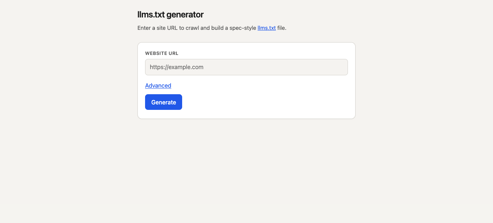
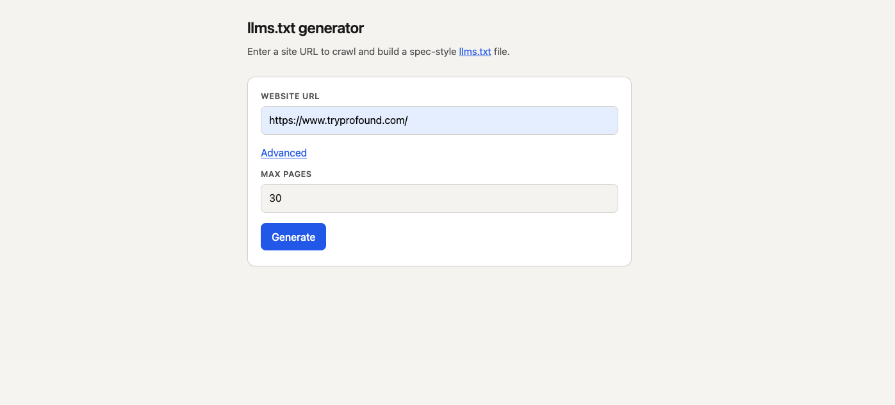
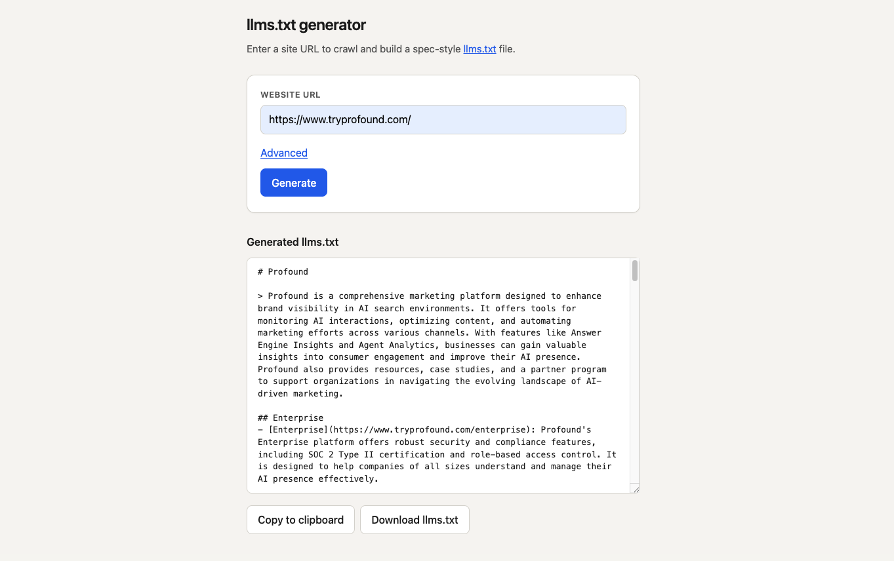

# llms.txt Generator

A web app that crawls a website and generates a spec-compliant [llms.txt](https://llmstxt.org/) file. It uses LLM to enrich page metadata and infer site structure, with a rule-based fallback (i.e. extracting HTML tags) when the API is unavailable.

## How it works

1. Crawls the site (BFS, by default up to 30 pages and with max crawl depth = 2)
2. Extracts metadata from each page (title, description, section hints)
3. Uses LLM to generate descriptions, a site summary, and section groupings/rankings
4. Outputs a formatted `llms.txt` file

## Setup

**Prerequisites:** Python 3.14+, Node.js (for the Vercel CLI)

```bash
# Install Python dependencies
pip install -r requirements.txt

# Install Vercel CLI
npm install
```

**Environment variables** — copy `.env.example` to `.env` and fill in your key:

```bash
cp .env.example .env
```

| Variable | Required | Default | Description |
|---|---|---|---|
| `OPENAI_API_KEY` | Yes | — | OpenAI API key |
| `OPENAI_MODEL` | No | `gpt-4o-mini` | Model to use for enrichment |

If no API key is provided, it will fall back to rule-based metadata extraction.

## Running locally

```bash
# Using the Vercel dev server (recommended — mirrors production routing)
npx vercel dev

# Or using Flask directly
flask --app api.generate run
```

The app is available at `http://localhost:3000` (Vercel) or `http://localhost:5000` (Flask).

## Running tests

```bash
pytest
```

The tests are in the [`tests/`](tests/) directory.

## Deployment

The app is deployed on Vercel as a serverless Python function.

```bash
# Deploy to production
npx vercel --prod
```

Before deploying, set `OPENAI_API_KEY` (and optionally `OPENAI_MODEL`) as environment variables in the Vercel project dashboard under **Settings → Environment Variables**.

The `api/requirements.txt` file controls which packages are installed in the Vercel runtime — keep it in sync with any new runtime dependencies added to the root `requirements.txt`.

## Screenshots

Home page:



URL input and options:



Generated `llms.txt` preview:



## More documentation

- **[`docs/`](docs/)** — module-level documentation (architecture, crawler, LLM pipeline, frontend, and related utilities).
- **[`example_outputs/`](example_outputs/)** — sample generated outputs (for example `profound_llm.md` and `profound_no_llm.md`).
